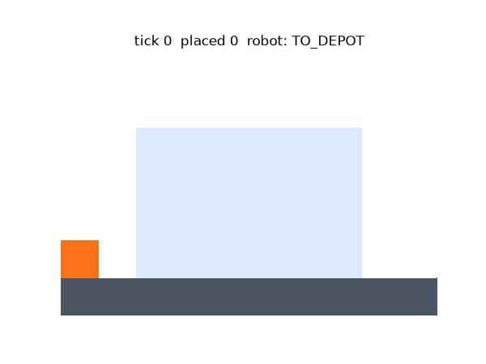
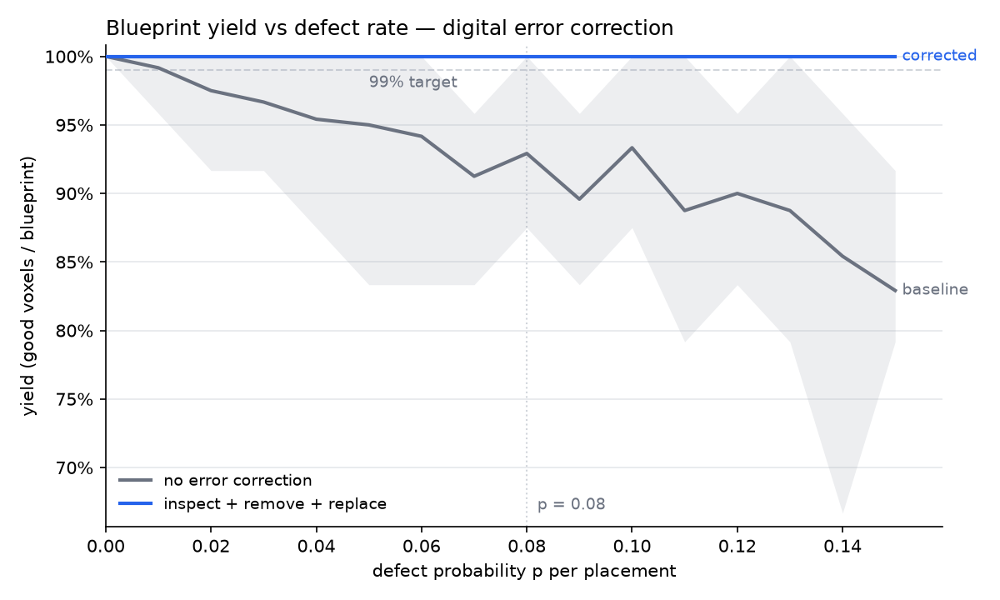

# discrete-assembly-sim

**An open discrete-assembly simulator: blueprint → validated build order → robot execution → defect detection & error correction — with a replayable log of every run.**

A small "relative robot" (MIT BILL-E / NASA ARMADAS lineage) crawls on the voxel structure it is building: it fetches parts from a depot, places them per a solver-validated build order, inspects every placement, and removes-and-replaces defective parts by replanning from the world as it actually is.



## The point: error correction makes yield digital

Discrete ("digital") materials promise the same thing for matter that error correction gave to data: **reliable wholes from unreliable steps**. Each placement here fails with probability *p* (a bad bond — the part sits in the lattice but doesn't count). A blind builder's yield decays like (1−p)ⁿ-per-part; a builder that inspects each placement, removes bad parts, and replans holds ~100% yield and simply pays a time cost instead:



At the spec point (p = 0.08, 10 seeds): **corrected yield 100% (target ≥ 99%: PASS)**; the no-correction baseline decays roughly as (1−p) to ~83% at p = 0.15. Reproduce with `python main.py yield`.

In a survey of 42 related research codebases (MIT CBA, NASA-lineage, TERMES, assembly-planning papers), build-time error correction appeared only rarely — mostly as closed-form theory, not as a working inspect-and-replan loop. This sim makes that loop concrete and measurable.

## Quickstart

Requires Python 3.10+.

```bash
git clone https://github.com/jdyar/discrete-assembly-sim.git && cd discrete-assembly-sim
python -m venv .venv
source .venv/bin/activate        # Windows: .venv\Scripts\activate
pip install -r requirements.txt  # numpy + matplotlib

python main.py            # demo: build with defects (p=0.12) + repair -> runs/latest.json
python main.py yield      # the yield-vs-p experiment -> runs/yield_vs_p.png
python main.py slice1     # clean build, no defects, + ticks-per-voxel chart
python main.py slice0     # the original one-loop ASCII build

python -m unittest        # test suite (38 tests)
```

**Watch a run:** open `replay_viewer.html` in a browser and drop `runs/latest.json` onto it (play / pause / scrub / orbit). If you serve the repo root (`python -m http.server`) it auto-loads the latest run. No browser handy? `python -m sim.render runs/latest.json` animates the same log in matplotlib, or renders a GIF with `python -m sim.render runs/latest.json out.gif`.

## How it works

```
main.py                 # entry point / run configs (the modes above)
sim/
  world.py              # 2D numpy grid: occupancy (EMPTY/GROUND/VOXEL/DEFECT) + blueprint mask
  planner.py            # build-order solver (DFS + memoized dead ends) + independent plan validator
  robot.py              # robot state machine, locomotion rules, BFS pathing
  metrics.py            # per-tick run logging (replayable JSON, contract v1) + charts
  render.py             # ASCII frames + matplotlib animation of a run log
  parts.py              # placeholder for typed parts (roadmap)
tests/                  # unit + invariant tests for all of the above
replay_viewer.html      # zero-build Three.js replay viewer (drop a run log in)
```

**Robot** (`sim/robot.py`) — an inchworm-style relative robot that grips the structure: it may occupy any empty cell adjacent to ground or a placed voxel, crawls one cell per tick along surfaces (diagonals only when rounding a corner), and places into any of the 8 cells around its stance. It senses only adjacent cells plus its current task — no global knowledge except the blueprint and depot. One action per tick:

```
IDLE ──task──> TO_DEPOT ──at depot──> PICK ──picked──> TO_SITE
  ^                                                       │
  │                                        at approach ── ┘
  │                                                       v
  └── queue empty ── INSPECT(ok) <────────────────────  PLACE
         ^                │(defective)
         │                v
   replan loaded ────  REMOVE ── discard, halt, request replan
```

**Planner** (`sim/planner.py`) — computes the full build order upfront; the robot executes it blindly as a queue. Every accepted order guarantees, at every step with a depot round trip between placements: (1) the target is reachable from a legal stance when placed, (2) the robot is never stranded from the depot, (3) no unbuilt cell gets walled off. `None` is returned only on exhaustive proof that no valid order exists; hitting the search budget raises instead (feasibility undecided, never silently misreported). `validate_plan` re-simulates every plan against the same rules before execution — defense in depth.

**Error correction (the thesis demo)** — each placement is defective with probability *p* (bad bond: occupies the cell, crawlable, doesn't count toward completion, indistinguishable without inspecting). INSPECT costs 1 tick from the placement stance — modeled on ARMADAS's vision-free, fastening-time feedback. On a defect: REMOVE (1 tick), discard, halt, and request a replan; the executor re-runs the planner on the current world (replanning is offboard software and costs 0 robot ticks). The robot never mutates a plan — plan / execute / replan-on-failure.

**Run logs** — every run emits one JSON log (contract documented in `sim/metrics.py`) consumed by both the Three.js viewer and the matplotlib animator. Every milestone ends with a metrics chart, not just an animation.

## Background & references

This simulator is a software study of the **discrete lattice assembly** lineage — it is a simulator, not flight hardware:

- **Digital materials** — Gershenfeld et al. (MIT Center for Bits and Atoms): structures from small families of discrete, reversibly-joined parts; discreteness makes errors detectable and correctable, digital vs analog. Also Cheung & Gershenfeld, *Reversibly Assembled Cellular Composite Materials* (Science, 2013).
- **Relative robots** — Jenett & Gershenfeld, **BILL-E** (Bipedal Isotropic Lattice Locomoting Explorer): robots smaller than the structure that locomote on the lattice they build; the lattice provides alignment, so the robot needs no global precision.
- **NASA Ames ARMADAS** — the lineage's flagship: cuboctahedral voxels, SOLL-E inchworm builder robots, MMIC-I fastening robot; autonomous meter-scale builds demonstrated (Science Robotics, 2024). Notably, it error-corrects **without machine vision** — detection comes from fastening-time feedback, which this sim's 1-tick INSPECT models directly.
- **TERMES** — Werfel, Petersen & Nagpal, *Designing collective behavior in a termite-inspired robot construction team* (Science, 2014), and Petersen et al.'s error taxonomy for collective robotic construction, which motivates the defect model here.
- **Theory backbone** — Winfree's abstract Tile Assembly Model ("compile a shape into local rules"); the 1980 NASA summer study on self-replicating lunar factories as the long-arc reference.

The gap this project probes: in the codebases surveyed so far, no open, maintained toolchain covered **blueprint → validated build sequence → multi-robot choreography → verification/error-correction** end to end. (The supporting survey — deep-research reports and per-repo code digests of 42 codebases — lives in a companion research repo.)

## Roadmap

Built in vertical slices — every milestone is a running end-to-end program:

- ✅ **Slice 0** — world + blueprint + one-voxel-per-tick loop (ASCII)
- ✅ **Slice 1** — single robot, build-order solver, full 6×4 wall (402 ticks, 16.8 ticks/voxel), replay viewer + metrics
- ✅ **Slice 2** — defects + inspect/remove/replan; ≥99% yield at p = 0.08 (this README's chart)
- ⏳ **Slice 3** — multiple robots: collision avoidance, task claiming, speedup-vs-robots chart
- ⏳ **Slice 4** — typed part family (rigid / flexible / conductive / actuator): a structure that is also a machine
- ⏳ **Slice 5** — 3D lattice + gravity + structural checks on partial builds

## License

MIT — see [LICENSE](LICENSE). Released permissively on purpose: the academic code in this space is almost entirely unlicensed or noncommercial, and the field needs a reference implementation it can legally build on.
