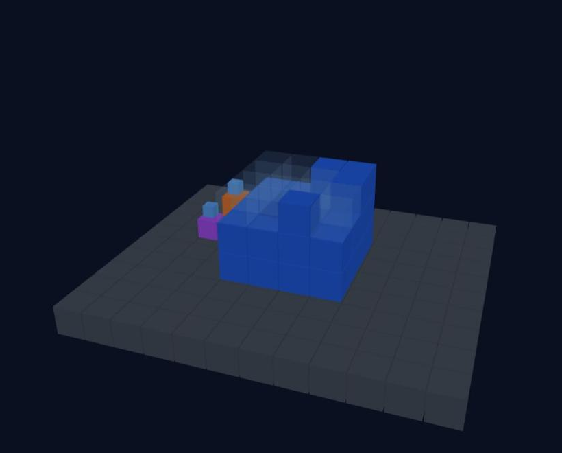
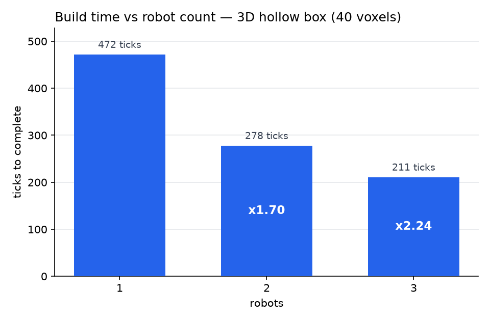

# discrete-assembly-sim

**An open coordination stack for lattice-building robot swarms: blueprint → validated build order → multi-robot choreography → verification & error correction — with a replayable log of every run.**

Small "relative robots" (MIT BILL-E / NASA ARMADAS lineage) crawl on the voxel structure they are building: they fetch parts from a depot, claim tasks from a solver-validated build order, negotiate space through a shared reservation table, inspect every placement, and remove-and-replace defective parts *while the rest of the swarm keeps working*.



**30-second version:** the robots for discrete lattice assembly exist (NASA, MIT, Harvard have all flown or published them) — but the *coordination software* is the missing layer. NASA's planner isn't public, the best academic planner is legally unusable (no license), and nobody ships a working mid-swarm repair loop. This repo is that layer, MIT-licensed, built so you can plug in **your** robot's capabilities as config.

## Why 3D is the game

The same coordination code that manages **zero speedup in 2D** (a wall build is a single-file corridor — the second robot starves) gets **real parallelism in 3D**, because the structure's surface gives robots room to route around each other:



Zero collisions, zero deadlocks, roof placed last so nobody gets sealed inside. Reproduce with `python main.py speedup3d`.

## Error correction makes yield digital

Discrete ("digital") materials promise what error correction gave to data: **reliable wholes from unreliable steps**. Each placement fails with probability *p* (a bad bond). A blind builder's yield decays like (1−p)ⁿ; a builder that inspects, removes, and replans holds ~100% yield and pays time instead:


At p = 0.08 (10 seeds): **corrected yield 100%**; the baseline decays to ~83% at p = 0.15. Reproduce with `python main.py yield`. In a survey of 42 related research codebases, a working inspect-remove-replan loop appeared in none of them.

## Quickstart

Requires Python 3.10+. Pure Python + numpy + matplotlib — no game engine, no ROS, no build step.

```bash
git clone https://github.com/jdyar/discrete-assembly-sim.git && cd discrete-assembly-sim
python -m venv .venv
source .venv/bin/activate        # Windows: .venv\Scripts\activate
pip install -r requirements.txt

python main.py swarm3d 2      # 2 robots build a 3D hollow box -> runs/latest.json
python main.py speedup3d      # the speedup-vs-N experiment -> runs/speedup_3d.png
python main.py swarm 2        # 2 robots, 2D wall (the degenerate case, kept honest)
python main.py                # single robot, defects + repair (the yield demo)
python main.py yield          # the yield-vs-p experiment -> runs/yield_vs_p.png

python -m unittest            # 82 tests, including the adversarial trap suite
```

**Watch a run:** open `replay_viewer.html` in a browser and drop `runs/latest.json` onto it — play / pause / scrub / orbit, 2D and 3D logs both. Serve the repo root (`python -m http.server`) and it auto-loads the latest run.

## Plug in your robot

The design bet of this repo: **coordination logic is invariant to robot hardware.** Everything your robot *is* lives behind two small seams, and the choreographer never looks past them:

- **`Geometry`** (`sim/geometry.py`) — what a lattice is: `neighbors(node)`, `is_footing(node)`, `reach_cells(node)`. Nodes are opaque values; the 2D square lattice and the 3D cubic lattice are both ~150-line implementations, and the test suite includes a string-node triangle-lattice fake to prove nothing upstream assumes coordinates.
- **`MotionModel`** (`sim/geometry3d.py`) — what your robot can do: today `reach_radius` (place a block up to N cells away, like SOLL-E-class strides and arms); next on the roadmap: climb limit, multi-cell inchworm steps, and two robots coupling into a longer arm (BILL-E cooperative manipulation lineage).

If your lab's robot climbs exactly one block (TERMES-style), that's config. If it places four cells away around a corner, that's config. The sequencer, reservation table, connectivity gates, and repair loop don't change — that invariance is tested, not aspirational: the 3D pivot ran the entire coordination stack on a new lattice with zero logic changes.

The **trap fixtures** (`tests/test_traps.py`, `tests/test_traps3d.py`) double as a benchmark: each one encodes a published failure class — TERMES-style enclosure deadlocks, MAPF corridor swaps, single-path interiors — with the reasoning in its docstring. If you're building your own planner, point it at these.

## How it works

```
main.py                 # entry point / run configs (the modes above)
sim/
  world.py, world3d.py  # occupancy grids (2D / 3D) + blueprint masks
  geometry.py           # THE SEAM: lattice interface + 2D square lattice
  geometry3d.py         # 3D cubic lattice + MotionModel (reach as config)
  planner.py            # build-order solver (proves safety at every step) + validator
  sequencer + swarm.py  # task claiming, kickback loop, displacement, watchdog
  choreographer.py      # cooperative A* over a time-expanded graph + placement gates
  reservations.py       # the shared table: leases (movement) + deeds (placement)
  texgraph.py           # time-expanded graph (space x time successor generation)
  robot.py              # single-robot state machine (the Slice 1-2 build)
  metrics.py            # replayable JSON run logs (v1/v2/v3) + charts
  render.py             # ASCII + matplotlib animation
tests/                  # 82 tests incl. spec-first adversarial trap fixtures
replay_viewer.html      # zero-build Three.js replay viewer (2D + 3D)
docs/DESIGN.md          # binding architecture rules + provenance per stage
```

The multi-robot core, in one paragraph: an idle robot claims the nearest task from the **sequencer**'s validated build order, and the **choreographer** plans its whole task (to depot → pick → to stance → place → inspect) as a shortest path through a **time-expanded graph** — space × time, where waiting is a move — against everyone's existing reservations. Before committing, two gates run: the placement must not disconnect any robot's future from the depot (**connectivity gate**, proven on the world-plus-all-deeds graph), and must leave the rest of the blueprint completable (**buildability gate**). A refusal is a **kickback**: the task returns for reordering and the world moves on — never a deadlock, never a frozen swarm. A defect found at inspect triggers remove + re-sequence *through* live traffic. Full rules and provenance: [docs/DESIGN.md](docs/DESIGN.md).

## Background & references

A software study of the **discrete lattice assembly** lineage — simulator, not flight hardware:

- **Digital materials** — Gershenfeld et al. (MIT CBA); Cheung & Gershenfeld, *Reversibly Assembled Cellular Composite Materials* (Science, 2013).
- **Relative robots** — Jenett & Gershenfeld, **BILL-E**: robots smaller than the structure, locomoting on the lattice they build; cooperative manipulation between coupled robots (NTRS 20170006219).
- **NASA Ames ARMADAS** — cuboctahedral voxels, SOLL-E inchworm builders, autonomous meter-scale builds (Gregg et al., Science Robotics, 2024). The choreography here is implemented clean-room from its published planning description: cooperative A*, node reservations, storage-location deadlock-freedom.
- **TERMES** — Werfel, Petersen & Nagpal (Science, 2014) + Petersen et al.'s error taxonomy; source of two of the trap-fixture failure classes.
- **MAPF** — Stern et al., *Multi-Agent Pathfinding: Definitions, Variants, and Benchmarks* (arXiv:1906.08291); source of the corridor-swap trap.
- **Theory backbone** — Winfree's Tile Assembly Model; the 1980 NASA self-replicating lunar factory study as the long arc.

## Roadmap

Built in vertical slices — every milestone is a running end-to-end program with a metrics chart:

- ✅ World, blueprint, single robot, validated build orders (6×4 wall)
- ✅ Error correction: inspect / remove / replan, ≥99% yield at p = 0.08
- ✅ Multi-robot choreographer: reservations, gates, adversarial trap suite (2D)
- ✅ 3D: cubic lattice behind the same interface, first real speedup (×2.24 @ 3 robots)
- ⏳ 3D at scale: fuzzed coordination, congestion knee (speedup-vs-N to 5+), mid-swarm repair in 3D
- ⏳ Motion-model realism: reach ≈ 4 with snake-arm articulation, climb limits, coupled-robot extended reach — all as config, with the coordination logic provably unchanged
- ⏳ Typed part families; gravity + structural checks on partial builds

## Contributing & feedback

Contributions and criticism are both welcome — this is meant to be the reference implementation the field can legally build on, and it gets better with more eyes on it.

- **Easiest high-value contribution: break it.** Write a trap — a blueprint + robot placement you believe deadlocks, starves, or entombs a robot — as a test like the ones in `tests/test_traps3d.py`. If it fails, you've found a real bug and the fixture is the regression test.
- **Have different hardware?** Implement a `Geometry`/`MotionModel` for your lattice or robot and tell us what the interface couldn't express — interface gaps are the most valuable bug reports this project can get.
- **Know this literature?** If we've mis-read or missed prior art (especially on reservation schemes or repair-during-construction), open an issue with the citation. Provenance corrections are taken seriously — see the clean-room policy in [docs/DESIGN.md](docs/DESIGN.md).
- Start with [CONTRIBUTING.md](CONTRIBUTING.md) for setup, test conventions, and the list of good first issues. For questions and design discussion, use [GitHub Discussions](../../discussions); for bugs, [Issues](../../issues).

## License

MIT — see [LICENSE](LICENSE). Released permissively on purpose: the academic code in this space is almost entirely unlicensed or noncommercial, and the field needs a reference implementation it can legally build on.
